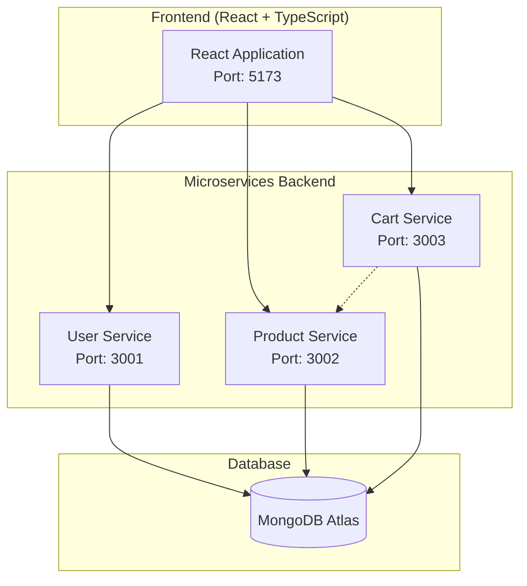

# 🎮 GameStore - Modern E-Commerce Web Application

<div align="center">


**A modern, scalable e-commerce platform for gaming enthusiasts built with cutting-edge technologies**

[](https://reactjs.org/)
[](https://www.typescriptlang.org/)
[](https://nodejs.org/)
[](https://www.mongodb.com/)
[](https://www.docker.com/)
[](https://tailwindcss.com/)
[](https://daisyui.com/)

[🚀 Live Demo](#) | [📖 Documentation](#features) | [🐛 Report Bug](https://github.com/bharat2468/cloud-project/issues) | [✨ Request Feature](https://github.com/bharat2468/cloud-project/issues)

</div>

## 🌟 Features

### 🎯 Core Functionality
- **🛒 Shopping Cart** - Add, remove, and manage gaming products
- **👤 User Authentication** - Secure JWT-based login/registration system
- **🔍 Advanced Search & Filter** - Find games by category, price, and name
- **🌙 Theme Switching** - 30+ beautiful themes with DaisyUI integration
- **📱 Responsive Design** - Seamless experience across all devices
- **💳 Checkout System** - Complete purchase flow with order management

### 🏗️ Technical Features
- **🔧 Microservices Architecture** - Scalable, maintainable service-oriented design
- **🐳 Containerized Deployment** - Docker & Docker Compose for easy deployment
- **🎨 Modern UI/UX** - Built with Tailwind CSS and DaisyUI components
- **⚡ Fast Performance** - Vite build tool for lightning-fast development
- **🔒 Security** - JWT authentication and input validation
- **📊 Real-time Updates** - Dynamic cart updates and notifications

## 🏗️ Architecture



## 🚀 Quick Start

### Prerequisites
- **Docker** & **Docker Compose** (Recommended)
- **Node.js** 18.x or higher
- **npm** or **yarn**
- **MongoDB Atlas** account

### 🐳 Option 1: Docker Deployment (Recommended)

1. **Clone the repository**
```bash
git clone https://github.com/bharat2468/cloud-project.git
cd cloud-project
```

2. **Set up environment variables**
Create `.env` files in each service directory:

**User/.env**
```env
PORT=3001
MONGO_DB_URL=your_mongodb_atlas_connection_string
DB_NAME=UserDB
ACCESS_TOKEN=your_secret_jwt_token
```

**Product/.env**
```env
PORT=3002
MONGO_DB_URL=your_mongodb_atlas_connection_string
DB_NAME=ProductDB
```

**Cart/.env**
```env
PORT=3003
MONGO_DB_URL=your_mongodb_atlas_connection_string
DB_NAME=CartDB
ACCESS_TOKEN=your_secret_jwt_token
PRODUCT_API_URL=http://product:3002
```

**front-end/.env**
```env
VITE_USER_API_URL=http://localhost:3001
VITE_PRODUCT_API_URL=http://localhost:3002
VITE_CART_API_URL=http://localhost:3003
```

3. **Launch the application**
```bash
docker compose up -d
```

4. **Start the frontend**
```bash
cd front-end
npm install
npm run dev
```

5. **Access the application**
- Frontend: http://localhost:5173
- User Service: http://localhost:3001
- Product Service: http://localhost:3002
- Cart Service: http://localhost:3003

### 💻 Option 2: Local Development

1. **Install dependencies for each service**
```bash
# User service
cd User && npm install

# Product service  
cd ../Product && npm install

# Cart service
cd ../Cart && npm install

# Frontend
cd ../front-end && npm install
```

2. **Start MongoDB** (local instance or Atlas)

3. **Start all services** (in separate terminals)
```bash
# Terminal 1 - User Service
cd User && npm start

# Terminal 2 - Product Service  
cd Product && npm start

# Terminal 3 - Cart Service
cd Cart && npm start

# Terminal 4 - Frontend
cd front-end && npm run dev
```

## 📁 Project Structure

```
E-Commerce_Web_Application/
├── 📁 front-end/              # React + TypeScript frontend
│   ├── 📁 src/
│   │   ├── 📁 components/     # Reusable UI components
│   │   ├── 📁 pages/         # Application pages
│   │   └── 📁 assets/        # Static assets
│   ├── 📄 package.json
│   └── 📄 vite.config.ts
├── 📁 User/                   # User authentication service
│   ├── 📁 controllers/        # Business logic
│   ├── 📁 models/            # MongoDB schemas
│   ├── 📁 routes/            # API endpoints
│   └── 📁 middleware/        # JWT validation
├── 📁 Product/                # Product management service
│   ├── 📁 controllers/        # Product operations
│   ├── 📁 models/            # Product schemas
│   └── 📁 routes/            # Product APIs
├── 📁 Cart/                   # Shopping cart service
│   ├── 📁 controllers/        # Cart operations
│   ├── 📁 models/            # Cart schemas
│   └── 📁 routes/            # Cart APIs
├── 📄 docker-compose.yml     # Container orchestration
├── 📄 products.json          # Sample product data
└── 📄 README.md              # Project documentation
```

## 🛠️ Technology Stack

### Frontend
- **⚛️ React 18** - Modern React with hooks and functional components
- **📝 TypeScript** - Type-safe JavaScript development
- **⚡ Vite** - Next generation frontend build tool
- **🎨 Tailwind CSS** - Utility-first CSS framework
- **🌈 DaisyUI** - Beautiful component library with 30+ themes
- **🛣️ React Router** - Declarative routing for React apps

### Backend
- **🟢 Node.js** - JavaScript runtime for server-side development
- **🚀 Express.js** - Fast, unopinionated web framework
- **🍃 MongoDB** - NoSQL database with Atlas cloud hosting
- **🔐 JWT** - JSON Web Tokens for secure authentication
- **🔒 bcrypt** - Password hashing library

### DevOps & Tools
- **🐳 Docker** - Containerization platform
- **🐙 Docker Compose** - Multi-container application management
- **📝 ESLint** - Code linting and formatting
- **🎯 Prettier** - Code formatting
- **📦 npm** - Package management

## 🔧 API Endpoints

### 👤 User Service (Port 3001)
```
POST   /users/register     # User registration
POST   /users/login        # User authentication  
GET    /users/profile      # Get user profile
PUT    /users/profile      # Update user profile
```

### 🎮 Product Service (Port 3002)
```
GET    /products           # Get all products
GET    /products/:id       # Get product by ID
GET    /products/category/:category  # Filter by category
GET    /filter/search      # Search products
```

### 🛒 Cart Service (Port 3003)
```
GET    /cart              # Get user's cart
POST   /cart/:productId   # Add product to cart
DELETE /cart/:productId   # Remove product from cart
DELETE /cart/checkout     # Checkout and clear cart
```

## 🎨 UI Components

### Modern Design System
- **🏠 ModernHome** - Landing page with hero section and product grid
- **🔐 ModernLogin/Register** - Sleek authentication forms
- **🛒 ModernCart** - Interactive shopping cart interface
- **📄 ModernProductInfo** - Detailed product view with reviews
- **👤 ModernProfile** - User account management
- **💳 ModernCheckout** - Streamlined checkout process
- **🧭 ModernNavBar** - Responsive navigation with theme switcher
- **🦶 Footer** - Site-wide footer with links and branding

## 🐳 Docker Services

The application runs as a multi-container setup:

```yaml
services:
  user:    # User authentication service (3001)
  product: # Product management service (3002) 
  cart:    # Shopping cart service (3003)
```

Each service is independently deployable and scalable.

## 🌍 Environment Variables

### Required Environment Variables

Create the following `.env` files:

**Global Configuration**
- `MONGO_DB_URL` - MongoDB Atlas connection string
- `ACCESS_TOKEN` - JWT secret key for authentication
- `PORT` - Service port number
- `DB_NAME` - Database name for each service

**Service-Specific**
- `PRODUCT_API_URL` - Internal product service URL (Cart service)
- `VITE_*_API_URL` - Frontend API endpoints

## 🚀 Deployment

### Production Deployment with Docker

1. **Build production images**
```bash
docker compose -f docker-compose.prod.yml build
```

2. **Deploy to cloud provider**
```bash
docker compose -f docker-compose.prod.yml up -d
```

### Cloud Deployment Options
- **🌊 DigitalOcean App Platform**
- **☁️ AWS ECS/EKS** 
- **🔥 Google Cloud Run**
- **⚡ Vercel** (Frontend)
- **🚀 Railway** (Backend services)

## 🧪 Testing

```bash
# Run frontend tests
cd front-end && npm test

# Run backend tests  
cd User && npm test
cd Product && npm test
cd Cart && npm test
```

## 🔍 Troubleshooting

### Common Issues

**Docker containers not communicating:**
- Ensure all services use internal Docker network names
- Check environment variables in `.env` files

**Frontend API calls failing:**
- Verify backend services are running on correct ports
- Check CORS configuration in backend services

**Authentication issues:**
- Ensure JWT tokens match between User and Cart services
- Verify token expiration settings

## 🤝 Contributing

We welcome contributions! Please see our [Contributing Guidelines](CONTRIBUTING.md).

1. Fork the repository
2. Create a feature branch (`git checkout -b feature/amazing-feature`)
3. Commit your changes (`git commit -m 'Add amazing feature'`)
4. Push to the branch (`git push origin feature/amazing-feature`)
5. Open a Pull Request

## 📄 License

This project is licensed under the MIT License - see the [LICENSE](LICENSE) file for details.

## 🙏 Acknowledgments

Contributors
- [Bharat Pinjani](https://github.com/bharat2468)
- [Shivanshi Rawat](https://github.com/RawaShivanshi) 


---

<div align="center">

**⭐ Star this repository if you find it helpful!**

Made with ❤️ by the GameStore Team

[🔝 Back to Top](#-gamestore---modern-e-commerce-web-application)

</div>