# 🏗️ E-Commerce Application Architecture with Node-RED

## System Overview

```mermaid
graph TB
    %% Frontend Layer
    subgraph "Frontend Layer"
        FE[React Frontend<br/>Vite + TypeScript<br/>TailwindCSS + DaisyUI<br/>Port 5174]
    end
    
    %% API Gateway Layer
    subgraph "API Gateway Layer"
        NR[Node-RED Gateway<br/>Port 1880]
        
        subgraph "Node-RED Flows"
            UF[👤 User Flows<br/>Register, Login, Profile]
            PF[🎮 Product Flows<br/>Browse, Search, Filter]
            CF[🛒 Cart Flows<br/>Add, Remove, Checkout]
        end
    end
    
    %% Microservices Layer
    subgraph "Microservices Layer"
        subgraph "User Service"
            US[User Service<br/>Node.js + Express<br/>Port 3001]
            UC[Controllers:<br/>• Registration<br/>• Authentication<br/>• Profile Management]
        end
        
        subgraph "Product Service"
            PS[Product Service<br/>Node.js + Express<br/>Port 3002]
            PC[Controllers:<br/>• CRUD Operations<br/>• Search & Filter<br/>• Categories]
        end
        
        subgraph "Cart Service"
            CS[Cart Service<br/>Node.js + Express<br/>Port 3003]
            CC[Controllers:<br/>• Add/Remove Items<br/>• Cart Management<br/>• Checkout]
        end
    end
    
    %% Database Layer
    subgraph "Database Layer"
        DB[(MongoDB Atlas<br/>Cloud Database<br/>• Users Collection<br/>• Products Collection<br/>• Carts Collection)]
    end
    
    %% Container Layer
    subgraph "Container Management"
        DOCKER[Docker Compose<br/>Orchestrates all services]
    end
    
    %% Main connections (reduced arrows)
    FE --> NR
    NR --> UF
    NR --> PF
    NR --> CF
    
    UF --> US
    PF --> PS
    CF --> CS
    
    US --> DB
    PS --> DB
    CS --> DB
    
    DOCKER -.-> US
    DOCKER -.-> PS
    DOCKER -.-> CS
    DOCKER -.-> NR

    %% Styling
    classDef frontend fill:#e1f5fe,stroke:#01579b,stroke-width:2px
    classDef gateway fill:#f3e5f5,stroke:#4a148c,stroke-width:2px
    classDef flows fill:#f8bbd9,stroke:#ad1457,stroke-width:1px
    classDef service fill:#e8f5e8,stroke:#1b5e20,stroke-width:2px
    classDef controller fill:#c8e6c9,stroke:#2e7d32,stroke-width:1px
    classDef database fill:#fff3e0,stroke:#e65100,stroke-width:2px
    classDef container fill:#fce4ec,stroke:#880e4f,stroke-width:2px

    class FE frontend
    class NR gateway
    class UF,PF,CF flows
    class US,PS,CS service
    class UC,PC,CC controller
    class DB database
    class DOCKER container
```



## API Flow Through Node-RED


## Example: Add Product to Cart


## Key Benefits of Node-RED

### 🎯 **What Node-RED Does**
- **API Gateway**: Single entry point for all requests
- **Authentication**: Validates JWT tokens centrally  
- **Data Enrichment**: Adds product details to cart responses
- **Error Handling**: Consistent error messages
- **Monitoring**: Tracks API usage and performance

### ✅ **Benefits**
- **Simplified Frontend**: Only connects to Node-RED (port 1880)
- **Enhanced Responses**: Cart shows product names, not just IDs
- **Centralized Logic**: Authentication and validation in one place
- **Easy Scaling**: Add new services without changing frontend
- **Visual Programming**: Configure APIs with drag-and-drop

### 🔧 **Your Current Setup**
```
Frontend (5174) → Node-RED (1880) → User Service (3001)
                                  → Product Service (3002) 
                                  → Cart Service (3003)
                                  ↓
                              MongoDB Atlas
```